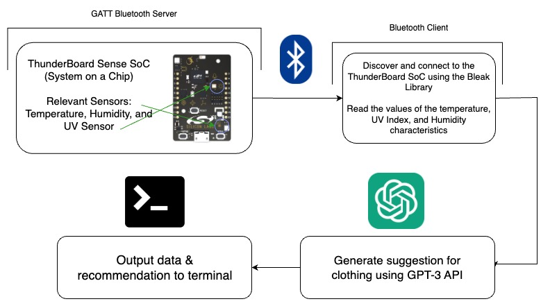

# Wear for the Weather

Everyday, before going to work or school, we're faced with a pressing question: "what should I wear today?" And, one factor that warrants consideration while choosing our outfit is the weather outside (e.g., hot weather entails short sleeves and sunglasses whereas cold weather necessitates a jacket and jeans). Enter **Wear for the Weather**: based on current weather conditions — temperature, humidity, and UV index — retrieved from the ThunderBoard Sense SoC, this application recommends the appropriate clothing for the user. The suggestion is retrieved from the GPT-3 API and displayed on the terminal.

## Architecture Diagram



As shown above, the architecture of the **Wear for the Weather** application is relatively simple: the [ThunderBoard Sense 2 SoC](https://os.mbed.com/platforms/thunderboard-sense-2/) gauges environmental conditions through a multitude of measurements supplied by the board's sensors and acts as the bluetooth server that broadcasts the environmental data to a client. The server-side software is configured through Simplicity Studio (see below).

Given that libraries such as bluepy only run on Linux machines, I used the [Bleak (Bluetooth Low Energy platform Agnostic Klient)](https://bleak.readthedocs.io/en/latest/) Python library to establish the connection between the client (the computer where this code is hosted) and the server (the Thunderboard SoC) and retrieve data from the latter party.

## Steps for Installation

1. Boot up your Thunderboard and connect it to your PC
2. Install the [Simplicity Studio IDE](https://www.silabs.com/developers/simplicity-studio) - don't feel bad if this step seems difficult because, quite ironically, the "Simplicity Studio" is quite the perplexing development interface
   - Create an account when prompted to do so
   - Install ALL of the SDKs presented on screen
3. Once the Thunderboard is connected properly and appears underneath the "Connected Devices" pane on the welcome screen, click on the blue "Start" button and
4. Click "Example Products and Demos" and search for "Bluetooth SoC Thunderboard." Download and install the aforementioned project.
5. Run the project on Simplicity Studio (the Thunderboard needs to be connected even WHILE the project is running)

If the project is running on the Thunderboard, you've successfully initiated a BLE server on your Thunderboard. Now, the next phase is connecting to the server by utilizing the Bleak python library, which can be installed using the command below (be sure that [Python](https://www.python.org/) is installed and properly configured beforehand):

```
pip install bleak
```

Clone the repository and run the discover.py file:

```bash
git clone https://github.com/RaviTejGuntuku/WearForTheWeather.git
python discover.py
```

Note down the UUID of your Thunderboard and modify the address variable in the bleak_connect_tb.py file accordingly. Uncomment the code for previewing the metadata of the bluetooth device's services and jot down the UUIDs of the relevant service and characteristics (temperature, humidity, UV index, etc.). Modify the UUIDs of the latter variables accordingly.

## Areas for Improvement

- [ ] Convert client-side code to an object-oriented structure to streamline programmer experience
- [ ] Create a Flask UI for application
- [ ] Create own neural network to avoid fallacious recommendations furnished by GPT-3
- [ ] Affix cooling system and case to ThunderBoard SoC to ameliorate internal heating's effect on temperature measurements
